# 🚀 VisionTera AI - Implementation Pipeline

> **Project**: VisionTera AI - Person Detection & Gender Classification
> **Version**: 1.0
> **Last Updated**: February 11, 2026
> **Status**: 🟢 Active Development

---

## 📋 Table of Contents

1. [System Overview](#system-overview)
2. [High-Level Architecture](#high-level-architecture)
3. [Pipeline Phases](#pipeline-phases)
4. [Detailed Task Breakdown](#detailed-task-breakdown)
5. [Data Flow Diagram](#data-flow-diagram)
6. [Component Architecture](#component-architecture)
7. [Deployment Strategy](#deployment-strategy)
8. [Timeline & Milestones](#timeline--milestones)

---

## 🎯 System Overview

VisionTera AI is a comprehensive real-time video analytics system that processes video streams from NVR (Network Video Recorder) to Cloud infrastructure. The system performs:

- **Person Detection** using YOLOv11n
- **Gender Classification** using YOLOv11m/ResNet50
- **Real-time Analytics** with live data streaming
- **Cloud Synchronization** for centralized monitoring

---

## 🏗️ High-Level Architecture

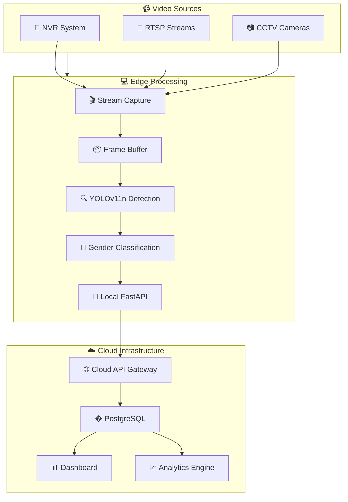

---

## 📊 Pipeline Phases

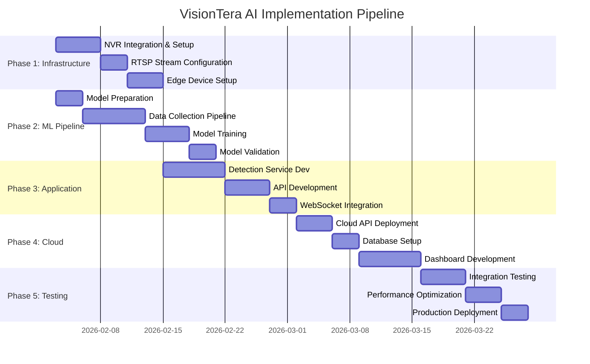

---

## 📝 Detailed Task Breakdown

### Phase 1: Infrastructure Setup 🔧

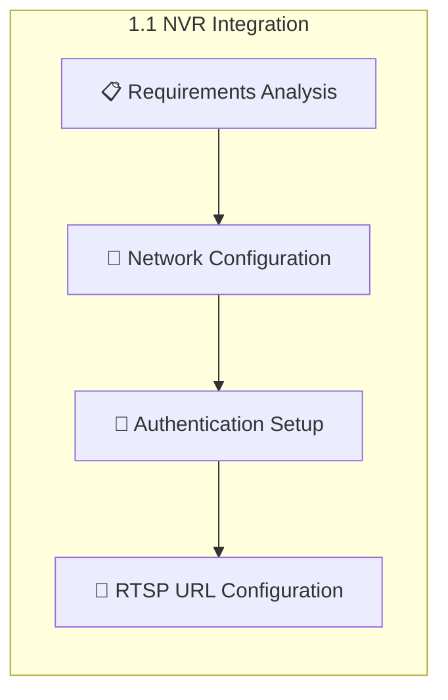

| Task ID | Task Name | Description | Priority | Status |
|---------|-----------|-------------|----------|--------|
| 1.1.1 | NVR Discovery | Identify and document all NVR devices | 🔴 High | ⬜ To Do |
| 1.1.2 | Network Mapping | Map network topology for NVR access | 🔴 High | ⬜ To Do |
| 1.1.3 | Credential Management | Secure storage of NVR credentials | 🔴 High | ⬜ To Do |
| 1.1.4 | RTSP URL Configuration | Configure RTSP streams per camera | 🔴 High | ⬜ To Do |
| 1.2.1 | Edge Device Provisioning | Set up edge computing devices | 🟡 Medium | ⬜ To Do |
| 1.2.2 | GPU Driver Installation | Install CUDA/DeepStream drivers | 🟡 Medium | ⬜ To Do |
| 1.2.3 | Python Environment Setup | Configure Python virtual environment | 🟡 Medium | ⬜ To Do |

---

### Phase 2: ML Pipeline 🤖

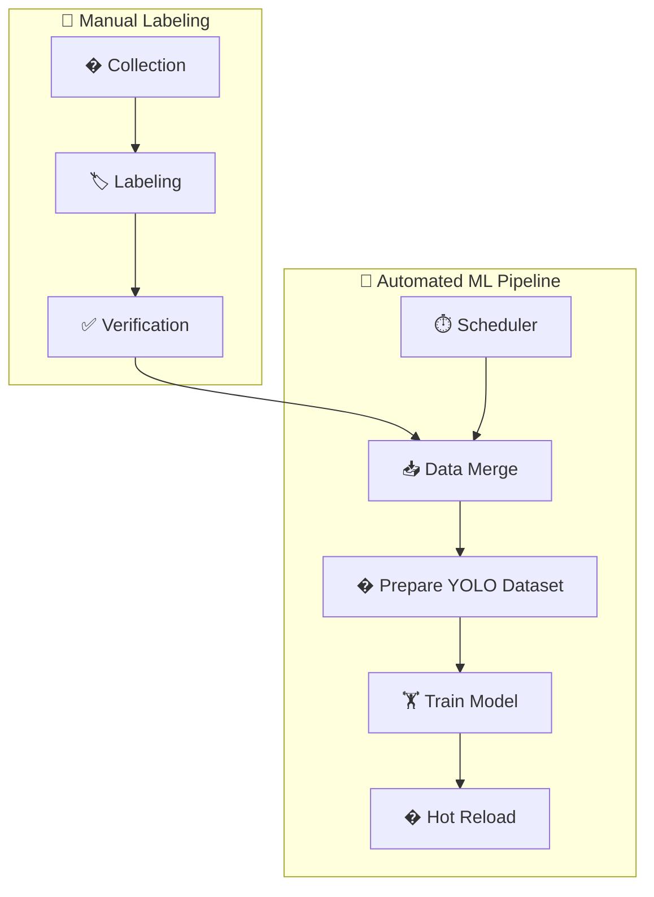

| Task ID | Task Name | Description | Priority | Status |
|---------|-----------|-------------|----------|--------|
| 2.1.1 | CCTV Image Collection | Extract frames from CCTV streams | 🔴 High | ⬜ To Do |
| 2.1.2 | Person Detection & Crop | Detect and crop person regions | 🔴 High | ✅ Done |
| 2.1.3 | Gender Auto-Labeling | Initial auto-labeling using existing model | 🟡 Medium | ✅ Done |
| 2.1.4 | Manual QC Review | Human verification of labels | 🟡 Medium | ⬜ To Do |
| 2.1.5 | Dataset Merge | Merge with existing training data | 🟡 Medium | ✅ Done |
| 2.2.1 | YOLOv11-cls Training | Train gender classification model | 🔴 High | ✅ Done |
| 2.2.2 | Model Evaluation | Detailed accuracy metrics | 🔴 High | ✅ Done |
| 2.2.3 | Model Optimization | Optimize for inference speed | 🟡 Medium | ⬜ To Do |
| 2.3.1 | Automated Scheduler | Periodic retraining pipeline | 🔴 High | ✅ Done |
| 2.3.2 | Model Hot-Reloading | Reload model without restart | � High | ✅ Done |

---

### Phase 3: Application Development 💻

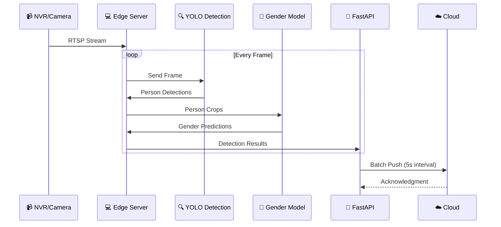

| Task ID | Task Name | Description | Priority | Status |
|---------|-----------|-------------|----------|--------|
| 3.1.1 | Stream Manager Service | Multi-camera stream handling | 🔴 High | ⬜ To Do |
| 3.1.2 | Detection Engine Enhancement | Optimize person detection pipeline | 🔴 High | ✅ Done |
| 3.1.3 | Gender Classification Service | Integrate gender model | 🔴 High | ✅ Done |
| 3.1.4 | Person Tracking | ByteTrack/BoT-SORT integration | 🟡 Medium | ⬜ To Do |
| 3.2.1 | REST API Endpoints | CRUD operations for streams | 🔴 High | ✅ Done |
| 3.2.2 | WebSocket Streaming | Real-time detection broadcast | 🟡 Medium | ⬜ To Do |
| 3.2.3 | Video Feed Endpoint | MJPEG/HLS stream output | 🟡 Medium | ⬜ To Do |
| 3.3.1 | Error Handling | Robust error recovery | 🟡 Medium | ⬜ To Do |
| 3.3.2 | Logging & Monitoring | Comprehensive logging | 🟢 Low | ✅ Done |

---

### Phase 4: Cloud Integration ☁️

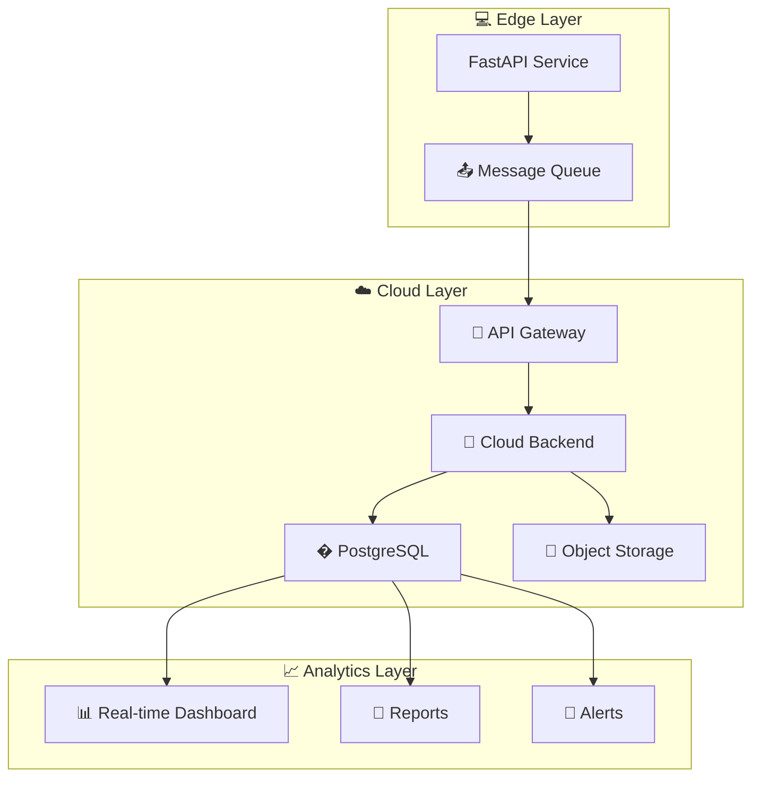

| Task ID | Task Name | Description | Priority | Status |
|---------|-----------|-------------|----------|--------|
| 4.1.1 | Cloud Backend Setup | Configure Cloud service | 🔴 High | ⬜ To Do |
| 4.1.2 | API Gateway Configuration | Set up API Gateway for edge | 🔴 High | ⬜ To Do |
| 4.1.3 | Authentication Service | JWT/OAuth implementation | 🔴 High | ✅ Done |
| 4.2.1 | PostgreSQL Setup | Relational database configuration | 🔴 High | ⬜ To Do |
| 4.2.2 | Data Warehousing | Historical data storage | 🟡 Medium | ⬜ To Do |
| 4.2.3 | Cloud Storage Setup | Media storage bucket | 🟡 Medium | ⬜ To Do |
| 4.3.1 | API Sync Service | Edge-to-Cloud data sync | 🔴 High | ⬜ To Do |
| 4.3.2 | Queue Management | Message queue for reliability | 🟡 Medium | ⬜ To Do |
| 4.4.1 | Dashboard Backend | Real-time data API | 🟡 Medium | ⬜ To Do |
| 4.4.2 | Dashboard Frontend | Web interface development | 🟡 Medium | ✅ Done |

---

### Phase 5: Testing & Deployment 🧪

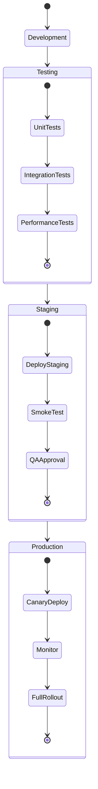

| Task ID | Task Name | Description | Priority | Status |
|---------|-----------|-------------|----------|--------|
| 5.1.1 | Unit Tests | Core function unit tests | 🟡 Medium | ⬜ To Do |
| 5.1.2 | Integration Tests | End-to-end pipeline tests | 🔴 High | ⬜ To Do |
| 5.1.3 | Performance Benchmarks | FPS, latency, accuracy metrics | 🔴 High | ⬜ To Do |
| 5.2.1 | Staging Deployment | Deploy to staging environment | 🔴 High | ⬜ To Do |
| 5.2.2 | Load Testing | Stress test with multiple streams | 🟡 Medium | ⬜ To Do |
| 5.3.1 | Production Deployment | Deploy to production | 🔴 High | ⬜ To Do |
| 5.3.2 | Monitoring Setup | APM and alerting | 🟡 Medium | ⬜ To Do |
| 5.3.3 | Documentation | User and API documentation | 🟢 Low | ⬜ To Do |

---

## 🔄 Data Flow Diagram

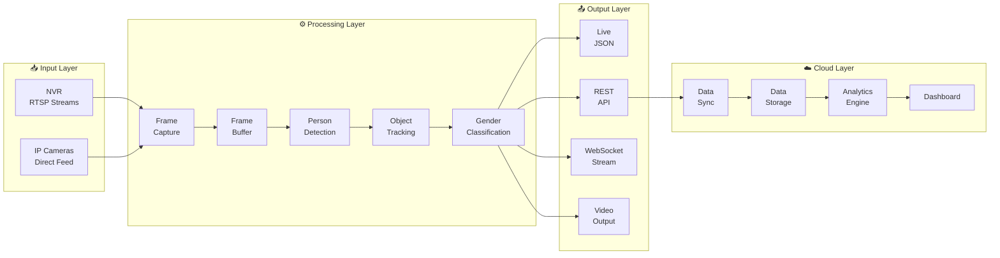

---

## 🧩 Component Architecture

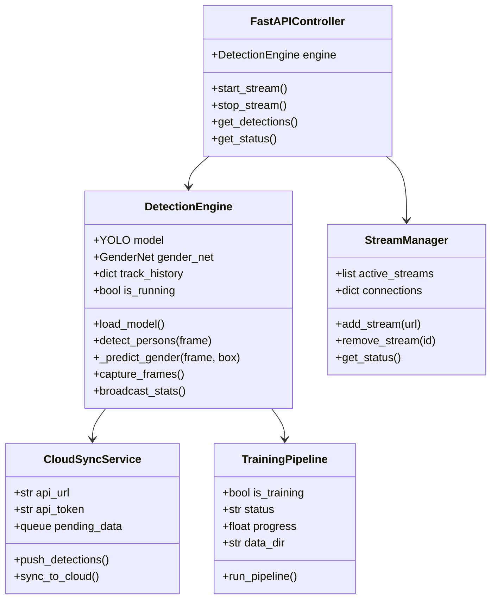

---

## 🚀 Deployment Strategy

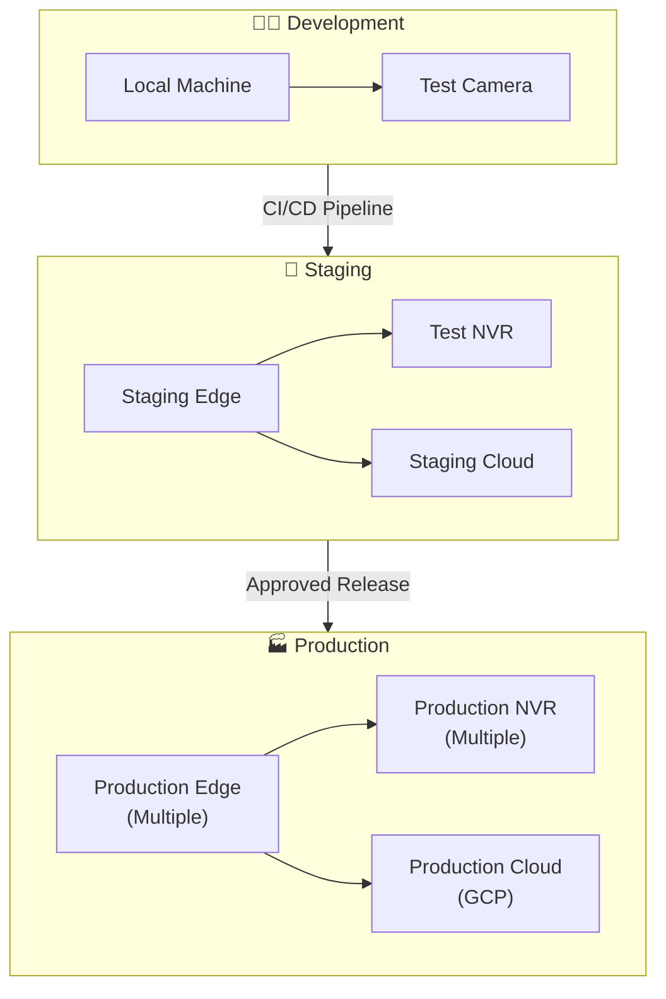

---

## ⏱️ Timeline & Milestones

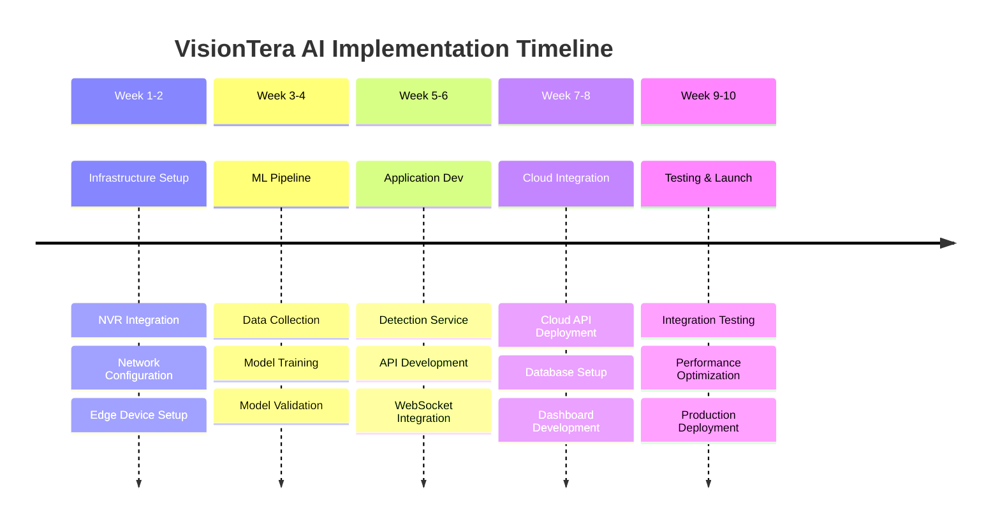

---

## 📊 Key Metrics & KPIs

| Metric | Target | Current | Status |
|--------|--------|---------|--------|
| Detection Accuracy | ≥ 95% | - | ⬜ Pending |
| Gender Classification Accuracy | ≥ 85% | 76% | 🟡 In Progress |
| Processing FPS | ≥ 30 | 60 | ✅ Met |
| API Response Time | ≤ 100ms | - | ⬜ Pending |
| Cloud Sync Latency | ≤ 5s | - | ⬜ Pending |
| System Uptime | ≥ 99.5% | - | ⬜ Pending |

---

## 🔗 Dependencies

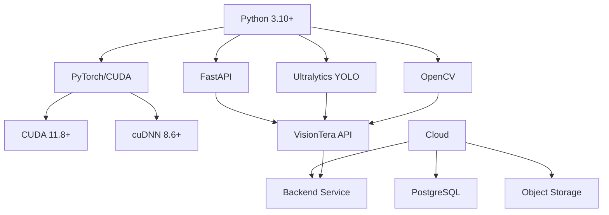

---

## 📞 Contacts & Resources

| Role | Name | Contact |
|------|------|---------|
| Project Lead | - | - |
| ML Engineer | - | - |
| Backend Developer | - | - |
| DevOps Engineer | - | - |

---

## 📚 References

- [YOLOv11 Documentation](https://docs.ultralytics.com/)
- [FastAPI Documentation](https://fastapi.tiangolo.com/)
- [GCP Cloud Run](https://cloud.google.com/run)
- [PyTorch Documentation](https://pytorch.org/docs/)

---

> **Note**: This document should be imported into Notion using the markdown import feature. All Mermaid diagrams will render automatically in Notion.

---

*Document maintained by VisionTera AI Team*
